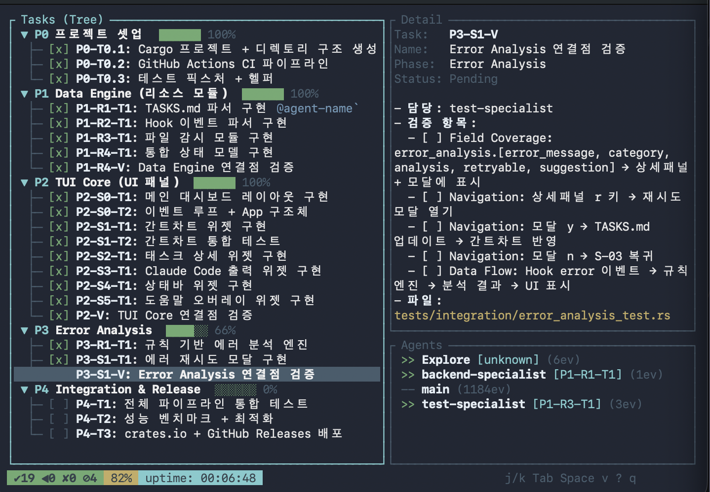

# oh-my-claude-board

> Claude Code orchestration TUI dashboard
> Claude Code 오케스트레이션 TUI 대시보드

Real-time visualization of Claude Code agent activity and task progress in your terminal.
터미널에서 Claude Code 에이전트 활동과 태스크 진행 상황을 실시간으로 시각화합니다.



## Features / 주요 기능

- **Live task tracking / 실시간 태스크 추적** -- Watches `TASKS.md` and updates the Gantt chart on every save / `TASKS.md` 파일을 감시하여 저장할 때마다 간트 차트를 자동 갱신
- **Agent activity panel / 에이전트 활동 패널** -- Shows which Claude Code agents are running, their current tools, and errors / 실행 중인 Claude Code 에이전트, 현재 사용 중인 도구, 에러를 표시
- **Hook event bridge / 훅 이벤트 브릿지** -- Includes `event-logger.js` hook that logs tool use to JSONL for the dashboard to consume / `event-logger.js` 훅 스크립트가 도구 사용 이벤트를 JSONL로 기록하여 대시보드가 소비
- **Error analysis & retry / 에러 분석 & 재시도** -- Rule-based error categorization (12 patterns) with retry modal (`r` key) / 12가지 규칙 기반 에러 분류 및 재시도 모달(`r` 키)
- **File watcher / 파일 감시** -- Uses `notify` for filesystem events (FSEvents on macOS, inotify on Linux) / `notify` 크레이트로 파일시스템 이벤트 감지 (macOS: FSEvents, Linux: inotify)
- **Dual Gantt view / 이중 간트 뷰** -- Tree view with `▼`/`▶` collapse and `├─`/`└─` connectors, plus horizontal bar chart; toggle with `v` / 트리 뷰(`▼`/`▶` 접기)와 수평 막대 차트를 `v`로 전환
- **Vim-style navigation / Vim 스타일 탐색** -- `j`/`k` to navigate, `Tab` to switch panes, `Space` to collapse/expand, `?` for help / `j`/`k`로 이동, `Tab`으로 패널 전환, `Space`로 접기/펼치기, `?`로 도움말
- **Korean IME support / 한국어 IME 지원** -- Korean jamo keys (`ㅓ`=j, `ㅏ`=k, `ㅂ`=q) work as vim navigation / 한글 자모(`ㅓ`=j, `ㅏ`=k, `ㅂ`=q)로도 Vim 탐색 가능
- **~1MB binary / ~1MB 바이너리** -- Optimized release build with LTO and symbol stripping / LTO 및 심볼 제거로 최적화된 릴리스 빌드

## Prerequisites / 사전 요구사항

### Rust (1.75+)

```bash
# macOS / Linux
curl --proto '=https' --tlsv1.2 -sSf https://sh.rustup.rs | sh
source "$HOME/.cargo/env"

# Windows — download and run the installer / 인스톨러 다운로드 후 실행:
# https://rustup.rs (rustup-init.exe)

# Verify / 확인
rustc --version
```

### Node.js (18+, for hook script / 훅 스크립트용)

```bash
# macOS (Homebrew)
brew install node

# Linux (via nvm - recommended / 권장)
curl -o- https://raw.githubusercontent.com/nvm-sh/nvm/v0.40.1/install.sh | bash
nvm install --lts

# Windows — download the installer / 인스톨러 다운로드:
# https://nodejs.org

# Verify / 확인
node --version
```

## Installation / 설치

```bash
# From source / 소스에서 설치
cargo install --path .

# Or build locally / 또는 로컬 빌드
cargo build --release
# Binary at / 바이너리 위치: target/release/oh-my-claude-board
```

## CLI Reference / CLI 사용법

```
oh-my-claude-board [OPTIONS] [COMMAND]
```

| Option / 옵션 | Default / 기본값 | Description / 설명 |
|---|---|---|
| `--tasks <PATH>` | `./TASKS.md` (fallback: `./docs/planning/06-tasks.md`) | Path to TASKS.md file / TASKS.md 파일 경로 |
| `--hooks <PATH>` | `.claude/hooks` (fallback: `~/.claude/hooks`) | Hook JSONL event directory / 훅 JSONL 이벤트 디렉토리 |
| `--events <PATH>` | `~/.claude/dashboard` | Dashboard JSONL events directory / 대시보드 JSONL 이벤트 디렉토리 |

| Command / 명령 | Description / 설명 |
|---|---|
| `watch` (default / 기본) | Watch files and display live TUI dashboard / 파일 감시 및 라이브 TUI 대시보드 표시 |
| `init` | Initialize configuration / 설정 초기화 (placeholder) |

## File Paths / 파일 경로

The dashboard reads from three locations:
대시보드는 세 곳에서 데이터를 읽습니다:

```
./TASKS.md                          <-- --tasks (project task definitions / 프로젝트 태스크 정의)
.claude/hooks/*.jsonl               <-- --hooks (legacy hook event files / 레거시 훅 이벤트 파일)
~/.claude/dashboard/events.jsonl    <-- --events (event-logger.js output / event-logger.js 출력)
```

- `--tasks` points to a single file. The watcher monitors its parent directory.
  `--tasks`는 단일 파일을 가리킵니다. 감시기가 부모 디렉토리를 모니터링합니다.
- `--hooks` and `--events` are directories. All `*.jsonl` files inside are parsed at startup, and new writes are detected via `notify`.
  `--hooks`와 `--events`는 디렉토리입니다. 시작 시 모든 `*.jsonl` 파일을 파싱하고, `notify`로 새 쓰기를 감지합니다.
- `--events` defaults to `$HOME/.claude/dashboard`. The directory is created automatically by `event-logger.js` on first tool use.
  `--events`의 기본값은 `$HOME/.claude/dashboard`입니다. 첫 도구 사용 시 `event-logger.js`가 자동 생성합니다.
- Session ID is stored at `/tmp/claude-dashboard-session-id` and shared across all hook invocations within a session.
  세션 ID는 `/tmp/claude-dashboard-session-id`에 저장되며 세션 내 모든 훅 호출에서 공유됩니다.

## Quick Start / 빠른 시작

### 1. Install the hook / 훅 설치

Copy the event logger hook and register it in Claude Code settings:
이벤트 로거 훅을 복사하고 Claude Code 설정에 등록합니다:

```bash
# Create the events directory / 이벤트 디렉토리 생성
mkdir -p ~/.claude/dashboard

# Copy the hook script / 훅 스크립트 복사
cp hooks/event-logger.js ~/.claude/hooks/event-logger.js
```

Add to `~/.claude/settings.json` under both `PreToolUse` and `PostToolUse`:
`~/.claude/settings.json`의 `PreToolUse`와 `PostToolUse`에 다음을 추가합니다:

```json
{
  "matcher": "Task|Edit|Write|Read|Bash|Grep|Glob",
  "hooks": [
    {
      "type": "command",
      "command": "node \"${HOME}/.claude/hooks/event-logger.js\"",
      "timeout": 3
    }
  ]
}
```

### 2. Run the dashboard / 대시보드 실행

```bash
# Default: watches ./TASKS.md + ~/.claude/dashboard/events.jsonl
# 기본값: ./TASKS.md + ~/.claude/dashboard/events.jsonl 감시
oh-my-claude-board

# Custom paths / 커스텀 경로
oh-my-claude-board watch --tasks ./TASKS.md --hooks .claude/hooks --events ~/.claude/dashboard
```

### 3. Use Claude Code normally / Claude Code 정상 사용

Open another terminal and run Claude Code. The dashboard will show agent activity in real time.
다른 터미널을 열고 Claude Code를 실행합니다. 대시보드에 에이전트 활동이 실시간으로 표시됩니다.

## How It Works / 작동 원리

```
Claude Code (tool use / 도구 사용)
       |
       v
 event-logger.js          <-- PreToolUse / PostToolUse hook / 훅
       |
       v  (fs.appendFileSync)
 ~/.claude/dashboard/
   events.jsonl            <-- JSONL append-only log / 추가 전용 로그
       |
       v  (notify file watcher / 파일 감시기)
 oh-my-claude-board        <-- TUI dashboard / TUI 대시보드
       |
       v
 Terminal (ratatui)        <-- Rendered UI / 렌더링된 UI
```

**Event flow / 이벤트 흐름:**
1. Claude Code calls a tool (Edit, Bash, Task, etc.) / Claude Code가 도구를 호출합니다
2. `settings.json` triggers `event-logger.js` as a Pre/Post hook / `settings.json`이 `event-logger.js`를 Pre/Post 훅으로 트리거합니다
3. The hook appends a JSONL line to `~/.claude/dashboard/events.jsonl` / 훅이 JSONL 한 줄을 추가합니다
4. The dashboard's file watcher detects the change / 대시보드의 파일 감시기가 변경을 감지합니다
5. The hook parser reads new events and updates `DashboardState` / 훅 파서가 새 이벤트를 읽고 `DashboardState`를 갱신합니다
6. The Agents panel renders live agent status / 에이전트 패널이 실시간 상태를 렌더링합니다

**JSONL format / JSONL 형식:**
```json
{"event_type":"agent_start","timestamp":"2026-02-08T10:00:00Z","agent_id":"backend-specialist","task_id":"P1-R1-T1","session_id":"sess-abc123","tool_name":"backend-specialist"}
{"event_type":"tool_start","timestamp":"2026-02-08T10:00:01Z","agent_id":"main","task_id":"unknown","session_id":"sess-abc123","tool_name":"Edit"}
```

**TASKS.md format / TASKS.md 형식** (parsed by `nom` / `nom`으로 파싱):

```markdown
# Phase 0: Setup

### [x] P0-T0.1: Project init
- **blocked_by**: (none)

### [InProgress] P1-R1-T1: Parser
- **blocked_by**: P0-T0.1
```

Status tags / 상태 태그: `[x]` completed/완료, `[ ]` pending/대기, `[InProgress]` or `[/]` in progress/진행중, `[Failed]` or `[!]` failed/실패, `[Blocked]` or `[B]` blocked/차단

## Keybindings / 키바인딩

| Key / 키 | Action / 동작 |
|---|---|
| `j` / `Down` (`ㅓ`) | Move down / 아래로 이동 |
| `k` / `Up` (`ㅏ`) | Move up / 위로 이동 |
| `Tab` | Switch focus (Task List / Detail) / 패널 포커스 전환 |
| `Space` | Collapse/expand phase / 페이즈 접기/펼치기 |
| `v` | Switch view (Tree / Gantt bar) / 뷰 전환 (트리 / 간트 막대) |
| `r` (`ㄱ`) | Retry failed task / 실패 태스크 재시도 |
| `?` | Toggle help overlay / 도움말 오버레이 토글 |
| `q` / `Esc` (`ㅂ`) | Quit / 종료 |

## Layout / 레이아웃

```
+------ 55% ------+------ 45% ------+
|                  |     Detail      |
|    Task List     |  태스크 상세    |
|   태스크 목록    |     (70%)       |
|                  +-----------------+
|                  |     Agents      |
|                  |  에이전트 활동  |
|                  |     (30%)       |
+------------------+-----------------+
|       Status Bar / 상태 바         |
+------------------------------------+
```

## Architecture / 아키텍처

```
src/
  main.rs              CLI entry point (clap) / CLI 진입점
  app.rs               App state + event handling / 앱 상태 + 이벤트 처리
  event.rs             Keyboard/file/timer event unification / 키보드/파일/타이머 이벤트 통합
  lib.rs               Crate root / 크레이트 루트
  data/
    tasks_parser.rs    TASKS.md parser (nom combinators) / TASKS.md 파서
    hook_parser.rs     JSONL event parser (serde_json) / JSONL 이벤트 파서
    watcher.rs         File watcher (notify 6) / 파일 감시기
    state.rs           Unified DashboardState model / 통합 대시보드 상태 모델
    tasks_writer.rs    TASKS.md write-back (status update) / TASKS.md 상태 쓰기
  ui/
    layout.rs          Screen split computation / 화면 분할 계산
    gantt.rs           Dual Gantt view (tree + horizontal bar) / 이중 간트 뷰
    detail.rs          Task detail panel / 태스크 상세 패널
    claude_output.rs   Agent activity panel / 에이전트 활동 패널
    statusbar.rs       Bottom status bar / 하단 상태 바
    help.rs            Help overlay popup / 도움말 오버레이 팝업
    retry_modal.rs     Retry confirmation modal / 재시도 확인 모달
  analysis/
    rules.rs           Error pattern matching rules / 에러 패턴 매칭 규칙
```

## Dependencies / 의존성

| Crate / 크레이트 | Version / 버전 | Role / 역할 |
|---|---|---|
| `ratatui` | 0.28 | TUI rendering framework / TUI 렌더링 프레임워크 |
| `crossterm` | 0.28 | Terminal I/O backend / 터미널 I/O 백엔드 |
| `tokio` | 1 | Async runtime (channels for file watcher) / 비동기 런타임 |
| `clap` | 4 | CLI argument parsing / CLI 인자 파싱 |
| `serde` + `serde_json` | 1 | JSONL deserialization / JSONL 역직렬화 |
| `nom` | 7 | TASKS.md parser combinators / TASKS.md 파서 조합기 |
| `notify` | 6 | Cross-platform file watcher (FSEvents/inotify) / 크로스 플랫폼 파일 감시기 |
| `chrono` | 0.4 | Timestamp parsing with serde support / 타임스탬프 파싱 |
| `anyhow` + `thiserror` | 1 / 2 | Error handling / 에러 처리 |
| `tracing` | 0.1 | Structured logging / 구조화된 로깅 |

## Development / 개발

```bash
# Run tests / 테스트 실행 (168 lib + 49 integration tests)
cargo test

# Run with ignored tests (macOS watcher flaky tests)
# 무시된 테스트 포함 실행 (macOS 감시기 불안정 테스트)
cargo test --lib -- --include-ignored

# Clippy
cargo clippy -- -D warnings

# Benchmarks / 벤치마크
cargo bench
```

### Performance / 성능

| Metric / 지표 | Result / 결과 | Target / 목표 |
|---|---|---|
| 1000 tasks parse / 1000개 태스크 파싱 | ~745us | <100ms |
| Full frame render / 전체 프레임 렌더 | ~55us | <16ms (60fps) |
| 1000 hook events / 1000개 훅 이벤트 | ~332us | <100ms |
| Release binary / 릴리스 바이너리 | ~1.1MB | <10MB |

## License / 라이선스

MIT
