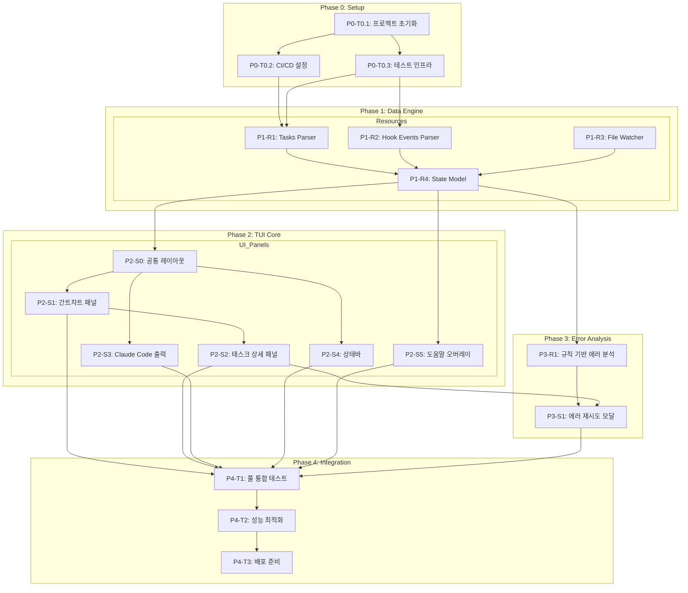

# TASKS.md — oh-my-claude-board

> Claude Code 오케스트레이션 TUI 대시보드
> Rust + Ratatui + Tokio + notify + nom

---

## 의존성 그래프



---

# Phase 0: 프로젝트 셋업

> main 브랜치에서 직접 작업 (Worktree 불필요)

## P0-T0.1: 프로젝트 초기화

### [x] P0-T0.1: Cargo 프로젝트 + 디렉토리 구조 생성
- **담당**: backend-specialist
- **스펙**: `cargo init oh-my-claude-board` 후 TRD 섹션 6 디렉토리 구조에 맞게 모듈 생성
- **파일**: `Cargo.toml`, `src/main.rs`, `src/lib.rs`, `src/app.rs`, `src/event.rs`, `src/config.rs`
- **세부**:
  - Cargo.toml 의존성 설정 (ratatui, crossterm, tokio, clap, notify, nom, serde_json, anyhow, thiserror, tracing)
  - `src/ui/mod.rs`, `src/data/mod.rs`, `src/analysis/mod.rs` 모듈 스켈레톤
  - clap CLI 기본 구조: `oh-my-claude-board watch [OPTIONS]`
  - .gitignore, LICENSE (MIT), README.md 기본 구조
- **완료 조건**:
  - [ ] `cargo build` 성공
  - [ ] `cargo clippy -- -D warnings` 경고 0개
  - [ ] `cargo fmt -- --check` 통과

## P0-T0.2: CI/CD 설정

### [x] P0-T0.2: GitHub Actions CI 파이프라인
- **담당**: backend-specialist
- **스펙**: PR 머지 전 품질 게이트 자동화
- **파일**: `.github/workflows/ci.yml`
- **세부**:
  - cargo fmt -- --check
  - cargo clippy -- -D warnings
  - cargo test
  - cargo build --release
  - Matrix: macOS, Linux
- **완료 조건**:
  - [ ] CI 파이프라인 정상 동작

## P0-T0.3: 테스트 인프라

### [x] P0-T0.3: 테스트 픽스처 + 헬퍼
- **담당**: test-specialist
- **스펙**: 테스트용 TASKS.md 샘플, Hook 이벤트 샘플, 테스트 헬퍼 함수
- **파일**: `tests/fixtures/sample_tasks.md`, `tests/fixtures/sample_hooks/`, `tests/helpers/mod.rs`
- **세부**:
  - sample_tasks.md: 3개 Phase, 각 2-3개 Task (다양한 상태 포함)
  - sample_hooks/: agent_start, tool_start, tool_end, error 이벤트 JSON Lines
  - 테스트 헬퍼: 임시 디렉토리 생성, 픽스처 로드 유틸리티
- **완료 조건**:
  - [ ] 픽스처 파일 유효성 검증 테스트 통과

---

# Phase 1: Data Engine (리소스 모듈)

> Worktree: `worktree/phase-1-data`

## P1-R1: Tasks Parser Resource

### [x] P1-R1-T1: TASKS.md 파서 구현
- **담당**: backend-specialist
- **리소스**: tasks
- **데이터 수집**: WATCH (file://TASKS.md) + PARSE (Markdown → 구조체)
- **필드**: phases, phase_id, phase_name, phase_status, phase_progress, task_id, task_name, task_status, task_agent, task_blocked_by
- **파일**: `tests/data/tasks_parser_test.rs` → `src/data/tasks_parser.rs`
- **스펙**: nom 파서 컴비네이터로 TASKS.md 파싱
  - H2 (`##`) → Phase 추출 (phase_id, phase_name)
  - H3 (`###`) → Task 추출 (task_id, task_name)
  - `[x]`/`[ ]`/`[InProgress]`/`[Failed]`/`[Blocked]` → task_status
  - `@agent-name` → task_agent
  - `blocked_by: P1-T1.2` → task_blocked_by
  - Phase progress = completed_tasks / total_tasks
- **Worktree**: `worktree/phase-1-data`
- **TDD**: RED → GREEN → REFACTOR
- **병렬**: P1-R2-T1, P1-R3-T1과 병렬 가능
- **완료 조건**:
  - [ ] `cargo test data::tasks_parser` 통과
  - [ ] sample_tasks.md 파싱 성공
  - [ ] 부분 파싱 실패 시 마지막 유효 상태 반환

---

## P1-R2: Hook Events Parser Resource

### [x] P1-R2-T1: Hook 이벤트 파서 구현
- **담당**: backend-specialist
- **리소스**: hook_events
- **데이터 수집**: WATCH (file://.claude/hooks/events/) + PARSE (JSON Lines)
- **필드**: event_type, timestamp, agent_id, task_id, tool_name, error_message, session_id
- **파일**: `tests/data/hook_parser_test.rs` → `src/data/hook_parser.rs`
- **스펙**: serde_json으로 JSON Lines 파싱
  - 각 줄을 독립 JSON 객체로 파싱
  - event_type: agent_start, agent_end, tool_start, tool_end, error
  - 잘못된 JSON 라인은 무시 (partial read 지원)
  - 타임스탬프 기준 정렬
- **Worktree**: `worktree/phase-1-data`
- **TDD**: RED → GREEN → REFACTOR
- **병렬**: P1-R1-T1, P1-R3-T1과 병렬 가능
- **완료 조건**:
  - [ ] `cargo test data::hook_parser` 통과
  - [ ] 잘못된 JSON 라인 무시 확인
  - [ ] 빈 파일 처리 확인

---

## P1-R3: File Watcher Resource

### [x] P1-R3-T1: 파일 감시 모듈 구현
- **담당**: backend-specialist
- **리소스**: tasks, hook_events (공통 감시)
- **데이터 수집**: WATCH (notify crate)
- **파일**: `tests/data/watcher_test.rs` → `src/data/watcher.rs`
- **스펙**: notify 6.x 기반 파일 시스템 감시
  - TASKS.md 파일 변경 감지 → 파싱 트리거
  - Hook 이벤트 디렉토리 감시 → 새 파일/수정 감지
  - 비동기 채널(mpsc)로 이벤트 전달
  - 디바운싱: 100ms 이내 중복 이벤트 무시
  - 감시 실패 시 자동 재연결 (3회 재시도)
- **Worktree**: `worktree/phase-1-data`
- **TDD**: RED → GREEN → REFACTOR
- **병렬**: P1-R1-T1, P1-R2-T1과 병렬 가능
- **완료 조건**:
  - [ ] `cargo test data::watcher` 통과
  - [ ] 파일 변경 500ms 이내 감지 확인
  - [ ] 감시 대상 파일 없을 때 graceful 처리

---

## P1-R4: Unified State Model

### [x] P1-R4-T1: 통합 상태 모델 구현
- **담당**: backend-specialist
- **리소스**: session (COMPUTE - 인메모리 상태)
- **필드**: tasks_md_path, hooks_dir, started_at, total_tasks, completed_tasks, failed_tasks, overall_progress, uptime
- **파일**: `tests/data/state_test.rs` → `src/data/state.rs`
- **스펙**: DashboardState 구조체 + 데이터 병합 로직
  - DashboardState: phases, selected_task, errors, session_metadata
  - Phase: id, name, status, progress, tasks, collapsed
  - Task: id, name, status, agent, started_at, completed_at, logs, error, blocked_by
  - 데이터 병합 규칙: TASKS.md(상태 우선) + Hook Events(에이전트/에러/타임스탬프 우선)
  - Session 메타데이터: started_at, total_tasks, completed/failed 카운터, overall_progress 계산
  - uptime 계산 (현재시각 - started_at)
- **의존**: P1-R1-T1, P1-R2-T1
- **Worktree**: `worktree/phase-1-data`
- **TDD**: RED → GREEN → REFACTOR
- **병렬**: 불가 (P1-R1-T1, P1-R2-T1 완료 후)
- **완료 조건**:
  - [ ] `cargo test data::state` 통과
  - [ ] TASKS.md + Hook 이벤트 병합 시나리오 테스트
  - [ ] 빈 상태(TASKS.md 없음) 처리 확인

### [x] P1-R4-V: Data Engine 연결점 검증
- **담당**: test-specialist
- **검증 항목**:
  - [ ] Field Coverage: tasks.[phases, phase_id, phase_name, phase_status, phase_progress, task_id, task_name, task_status, task_agent, task_blocked_by] 파서 출력에 존재
  - [ ] Field Coverage: hook_events.[event_type, timestamp, agent_id, task_id, tool_name, error_message] 파서 출력에 존재
  - [ ] Field Coverage: session.[total_tasks, completed_tasks, failed_tasks, overall_progress, uptime] 상태 모델에서 계산 가능
  - [ ] Data Merge: TASKS.md 상태 + Hook 에이전트 정보 병합 동작
  - [ ] Watcher → Parser → State 파이프라인 통합 테스트
- **파일**: `tests/integration/data_pipeline_test.rs`
- **Worktree**: `worktree/phase-1-data`

---

# Phase 2: TUI Core (UI 패널)

> Worktree: `worktree/phase-2-tui`

## P2-S0: 공통 레이아웃

### [x] P2-S0-T1: 메인 대시보드 레이아웃 구현
- **담당**: backend-specialist
- **화면**: S-01 메인 대시보드
- **컴포넌트**: left_panel (container), right_panel (container)
- **데이터 요구**: tasks, hook_events, session (data_requirements 참조)
- **파일**: `tests/ui/layout_test.rs` → `src/ui/layout.rs`
- **스펙**: Ratatui 레이아웃 구현
  - 좌/우 수평 분할 (기본 50:50, --split 옵션)
  - 좌측: 간트차트(상) + 상세패널(하) 수직 분할 (70:30)
  - 우측: Claude Code 출력
  - 하단: 상태바 (고정 1줄)
  - Tab 키로 좌/우 포커스 전환
  - 활성 패널 테두리 White, 비활성 DarkGray
  - 최소 터미널 크기 80x24 체크
- **의존**: P1-R4-T1
- **Worktree**: `worktree/phase-2-tui`
- **TDD**: RED → GREEN → REFACTOR
- **완료 조건**:
  - [ ] 레이아웃 렌더링 스냅샷 테스트 (insta)
  - [ ] Tab 포커스 전환 동작
  - [ ] 터미널 리사이즈 대응

### [x] P2-S0-T2: 이벤트 루프 + App 구조체
- **담당**: backend-specialist
- **파일**: `tests/app_test.rs` → `src/app.rs`, `src/event.rs`
- **스펙**: Tokio 기반 메인 이벤트 루프
  - `tokio::select!` 로 키보드/파일변경/타이머 이벤트 통합
  - App 구조체: state, focus, running 필드
  - 키보드 이벤트: crossterm 키 입력 수신
  - 파일 이벤트: watcher mpsc 채널 수신
  - 타이머: 1초 tick (uptime 업데이트)
  - q 키로 graceful 종료 (터미널 복원)
  - panic hook: 터미널 alternate screen 복원
- **의존**: P2-S0-T1
- **Worktree**: `worktree/phase-2-tui`
- **TDD**: RED → GREEN → REFACTOR
- **완료 조건**:
  - [ ] 이벤트 루프 시작/종료 테스트
  - [ ] q 키 종료 후 터미널 상태 복원 확인

---

## P2-S1: 간트차트 패널

### [x] P2-S1-T1: 간트차트 위젯 구현
- **담당**: backend-specialist
- **화면**: S-02 간트차트 패널
- **컴포넌트**: phase_row (list), task_row (list), cursor_highlight (detail)
- **데이터 요구**: tasks (data_requirements 참조)
- **파일**: `tests/ui/gantt_test.rs` → `src/ui/gantt.rs`
- **스펙**: 접이식 Phase/Task 트리 위젯
  - Phase 행: ▼/▶ 토글 + phase_name + 프로그레스바(█/░) + 상태심볼(✔/◀/○/✘)
  - Task 행: 트리커넥터(├─/└─) + task_name + 상태심볼 + agent명
  - j/k: 커서 이동
  - Space: Phase 접기/펼치기
  - Enter: 선택된 항목 상세를 S-03에 표시
  - 현재 행 Cyan 하이라이트
  - TASKS.md 변경 시 실시간 업데이트 (커서 위치 유지)
- **의존**: P2-S0-T2
- **Worktree**: `worktree/phase-2-tui`
- **TDD**: RED → GREEN → REFACTOR
- **병렬**: P2-S3-T1과 병렬 가능
- **완료 조건**:
  - [ ] Phase/Task 트리 렌더링 스냅샷 테스트
  - [ ] j/k 커서 이동 동작
  - [ ] Space 토글 동작
  - [ ] 실시간 업데이트 시 커서 위치 유지

### [x] P2-S1-T2: 간트차트 통합 테스트
- **담당**: test-specialist
- **화면**: S-02
- **시나리오**:
  | 이름 | When | Then |
  |------|------|------|
  | Phase/Task 트리 표시 | TASKS.md 파싱 완료 | Phase 접이식 행 + 트리커넥터 Task 표시 |
  | Phase 접기/펼치기 | Phase 행에서 Space | 하위 Task 숨김/표시 + ▼↔▶ |
  | 태스크 선택 | Task 행에서 Enter | S-03에 해당 Task 정보 표시 |
  | 실시간 업데이트 | TASKS.md 파일 변경 | 상태 반영 + 커서 위치 유지 |
- **파일**: `tests/integration/gantt_test.rs`
- **Worktree**: `worktree/phase-2-tui`

---

## P2-S2: 태스크 상세 패널

### [x] P2-S2-T1: 태스크 상세 위젯 구현
- **담당**: backend-specialist
- **화면**: S-03 태스크 상세 패널
- **컴포넌트**: task_header (detail), task_metadata (detail), task_logs (list), error_section (detail)
- **데이터 요구**: tasks, hook_events, error_analysis (data_requirements 참조)
- **파일**: `tests/ui/detail_test.rs` → `src/ui/detail.rs`
- **스펙**: 선택된 태스크의 상세 정보 표시
  - task_header: Task ID + 이름 + 상태심볼 (에러 시 빨간색)
  - task_metadata: 에이전트명, 시작/완료 시간, 경과 시간
  - task_logs: 최근 Hook 이벤트 로그 (타임스탬프 + 레벨 + 메시지)
  - error_section: 에러 메시지 + 분석 결과 + "[r] 재시도" 안내 (에러 태스크만)
  - 빈 상태: "태스크를 선택하세요 (j/k로 이동, Enter로 선택)"
  - 로그 스크롤 지원
- **의존**: P2-S1-T1
- **Worktree**: `worktree/phase-2-tui`
- **TDD**: RED → GREEN → REFACTOR
- **완료 조건**:
  - [ ] 일반 태스크 상세 렌더링 스냅샷 테스트
  - [ ] 에러 태스크 상세 렌더링 (빨간색 헤더, 분석 결과)
  - [ ] 빈 상태 렌더링

---

## P2-S3: Claude Code 출력 패널

### [x] P2-S3-T1: Claude Code 출력 위젯 구현
- **담당**: backend-specialist
- **화면**: S-05 Claude Code 출력
- **컴포넌트**: output_viewer (list)
- **데이터 요구**: hook_events (data_requirements 참조)
- **파일**: `tests/ui/claude_output_test.rs` → `src/ui/claude_output.rs`
- **스펙**: Hook 이벤트 기반 실시간 출력 표시
  - 자동 스크롤 (Follow 모드, 기본 활성)
  - j/k: 위/아래 스크롤 (위로 스크롤 시 Follow 일시 중지)
  - f: Follow 모드 토글
  - Follow 비활성 시 하단에 "↓ Follow (f)" 힌트
  - 빈 상태: "Claude Code 출력 대기 중..."
  - 출력 버퍼 크기 제한 (최대 10,000줄)
- **의존**: P2-S0-T2
- **Worktree**: `worktree/phase-2-tui`
- **TDD**: RED → GREEN → REFACTOR
- **병렬**: P2-S1-T1과 병렬 가능
- **완료 조건**:
  - [ ] Follow 모드 자동 스크롤 동작
  - [ ] 수동 스크롤 시 Follow 일시 중지
  - [ ] 빈 상태 렌더링

---

## P2-S4: 상태바

### [x] P2-S4-T1: 상태바 위젯 구현
- **담당**: backend-specialist
- **화면**: S-06 상태바
- **컴포넌트**: progress_summary (stat-card), status_counters (stat-card), uptime_display (detail), help_hint (detail), warning_icon (alert)
- **데이터 요구**: session, tasks (data_requirements 참조)
- **파일**: `tests/ui/statusbar_test.rs` → `src/ui/statusbar.rs`
- **스펙**: 하단 고정 1줄 상태바
  - progress_summary: "[67%] 8/12 tasks"
  - status_counters: "✔6 ◀2 ✘1 ⊘3"
  - uptime_display: "uptime: 00:45:12"
  - help_hint: "?:help"
  - warning_icon: 파일 감시 에러 시 ⚠ 표시
  - 매 초 uptime 업데이트
- **의존**: P2-S0-T1
- **Worktree**: `worktree/phase-2-tui`
- **TDD**: RED → GREEN → REFACTOR
- **병렬**: P2-S1-T1, P2-S3-T1과 병렬 가능
- **완료 조건**:
  - [ ] 상태바 렌더링 스냅샷 테스트
  - [ ] 상태 변경 시 카운터 업데이트

---

## P2-S5: 도움말 오버레이

### [x] P2-S5-T1: 도움말 오버레이 위젯 구현
- **담당**: backend-specialist
- **화면**: S-07 도움말 오버레이
- **컴포넌트**: keybinding_list (list), version_info (detail)
- **데이터 요구**: 없음 (정적 데이터)
- **파일**: `tests/ui/help_test.rs` → `src/ui/help.rs`
- **스펙**: 키바인딩 목록 중앙 오버레이
  - ? 키로 토글 (열기/닫기)
  - Esc 키로 닫기
  - 키바인딩 목록: j/k, Enter, Space, r, q, Tab, ?, f
  - 버전 정보: oh-my-claude-board v{version}
  - 배경 반투명 처리 (Ratatui Clear 위젯)
  - 이전 화면으로 포커스 복귀
- **의존**: P1-R4-T1
- **Worktree**: `worktree/phase-2-tui`
- **TDD**: RED → GREEN → REFACTOR
- **병렬**: P2-S1-T1, P2-S3-T1과 병렬 가능
- **완료 조건**:
  - [ ] 오버레이 렌더링 스냅샷 테스트
  - [ ] ?/Esc 토글 동작

### [x] P2-V: TUI Core 연결점 검증
- **담당**: test-specialist
- **검증 항목**:
  - [ ] Field Coverage: tasks.[phase_id, phase_name, phase_status, phase_progress, task_id, task_name, task_status, task_agent] → 간트차트에 표시
  - [ ] Field Coverage: hook_events.[timestamp, event_type, agent_id, tool_name, error_message] → 상세패널/출력패널에 표시
  - [ ] Field Coverage: session.[total_tasks, completed_tasks, failed_tasks, overall_progress, uptime] → 상태바에 표시
  - [ ] Navigation: 간트차트 Enter → 태스크 상세 패널 업데이트
  - [ ] Navigation: 태스크 상세 r 키 → 에러 재시도 모달 (P3-S1)
  - [ ] Navigation: Tab → 좌/우 패널 포커스 전환
  - [ ] Navigation: ? → 도움말 오버레이 토글
  - [ ] Shared: status_symbol 컴포넌트가 간트차트 + 상세패널 + 상태바에서 동일 렌더링
  - [ ] Shared: progress_bar 컴포넌트가 간트차트 + 상태바에서 동일 렌더링
- **파일**: `tests/integration/tui_connection_test.rs`
- **Worktree**: `worktree/phase-2-tui`

---

# Phase 3: Error Analysis

> Worktree: `worktree/phase-3-analysis`

## P3-R1: Error Analysis Resource

### [ ] P3-R1-T1: 규칙 기반 에러 분석 엔진
- **담당**: backend-specialist
- **리소스**: error_analysis
- **데이터 수집**: ANALYZE (internal://rules-engine)
- **필드**: error_message, category, analysis, retryable, suggestion
- **파일**: `tests/analysis/rules_test.rs` → `src/analysis/rules.rs`
- **스펙**: 패턴 매칭 기반 에러 분석
  - ErrorCategory: Type, Runtime, Network, Permission, Unknown
  - 패턴 규칙 (최소 10개):
    - "permission denied" → Permission, retryable: false
    - "connection refused" → Network, retryable: true
    - "timeout" → Network, retryable: true
    - "type error" / "cannot find" → Type, retryable: false
    - "out of memory" → Runtime, retryable: false
    - "rate limit" → Network, retryable: true
    - etc.
  - 각 패턴에 대한 suggestion 텍스트
  - Unknown 카테고리 폴백 (매칭 실패 시)
- **Worktree**: `worktree/phase-3-analysis`
- **TDD**: RED → GREEN → REFACTOR
- **완료 조건**:
  - [ ] `cargo test analysis::rules` 통과
  - [ ] 10개+ 에러 패턴 매칭 테스트
  - [ ] Unknown 폴백 동작

### [ ] P3-R1-T2: Anthropic API 연동 (선택적)
- **담당**: backend-specialist
- **리소스**: error_analysis
- **데이터 수집**: ANALYZE (https://api.anthropic.com/v1/messages)
- **파일**: `tests/analysis/api_test.rs` → `src/analysis/api.rs`
- **스펙**: Anthropic API를 통한 고급 에러 분석 (feature flag: `ai-analysis`)
  - reqwest HTTP 클라이언트
  - ANTHROPIC_API_KEY 환경변수에서 읽기
  - Haiku 모델 사용 (비용 최소화)
  - 타임아웃: 10초
  - API 실패 시 규칙 기반 분석으로 폴백
  - --no-ai 플래그로 비활성화 가능
- **의존**: P3-R1-T1
- **Worktree**: `worktree/phase-3-analysis`
- **TDD**: RED → GREEN → REFACTOR
- **완료 조건**:
  - [ ] Mock API 응답 기반 테스트 통과
  - [ ] API 실패 시 규칙 기반 폴백 확인
  - [ ] `--no-ai` 플래그 동작

---

## P3-S1: 에러 재시도 모달

### [ ] P3-S1-T1: 에러 재시도 모달 구현
- **담당**: backend-specialist
- **화면**: S-04 에러 분석 + 재시도
- **컴포넌트**: retry_confirm (modal), retry_progress (detail)
- **데이터 요구**: tasks, error_analysis (data_requirements 참조)
- **파일**: `tests/ui/error_retry_test.rs` → `src/ui/error_retry.rs`
- **스펙**: 에러 태스크 재시도 확인 모달
  - r 키 (상세 패널) → "Task {ID}를 재시도하시겠습니까? [y/n]" 모달
  - retryable=false → "이 에러는 재시도할 수 없습니다" 메시지, r 키 비활성화
  - y: TASKS.md 상태 업데이트 트리거 (InProgress로 변경)
  - n: 모달 닫기, S-03 복귀
  - 재시도 중: 스피너 + "재시도 중..." 메시지
  - 완료 후: 성공/실패 메시지 → S-03 복귀
- **의존**: P2-S2-T1, P3-R1-T1
- **Worktree**: `worktree/phase-3-analysis`
- **TDD**: RED → GREEN → REFACTOR
- **완료 조건**:
  - [ ] y/n 모달 동작 테스트
  - [ ] retryable=false 시 비활성화 확인
  - [ ] 재시도 후 상태 업데이트 확인

### [ ] P3-S1-V: Error Analysis 연결점 검증
- **담당**: test-specialist
- **검증 항목**:
  - [ ] Field Coverage: error_analysis.[error_message, category, analysis, retryable, suggestion] → 상세패널 + 모달에 표시
  - [ ] Navigation: 상세패널 r 키 → 재시도 모달 열기
  - [ ] Navigation: 모달 y → TASKS.md 업데이트 → 간트차트 반영
  - [ ] Navigation: 모달 n → S-03 복귀
  - [ ] Data Flow: Hook error 이벤트 → 규칙 엔진 → 분석 결과 → UI 표시
- **파일**: `tests/integration/error_analysis_test.rs`
- **Worktree**: `worktree/phase-3-analysis`

---

# Phase 4: Integration & Release

> Worktree: `worktree/phase-4-release`

## P4-T1: 풀 통합 테스트

### [ ] P4-T1: 전체 파이프라인 통합 테스트
- **담당**: test-specialist
- **파일**: `tests/integration/full_pipeline_test.rs`
- **스펙**: 전체 데이터 흐름 + UI 통합 검증
  - TASKS.md 파일 생성 → 감지 → 파싱 → 상태 모델 → 간트차트 렌더링
  - Hook 이벤트 생성 → 감지 → 파싱 → 상세 패널 업데이트
  - 에러 이벤트 → 분석 → 재시도 모달 → 상태 업데이트
  - 전체 키보드 인터랙션 시나리오
- **의존**: P2-V, P3-S1-V
- **Worktree**: `worktree/phase-4-release`
- **완료 조건**:
  - [ ] 전체 통합 테스트 통과
  - [ ] 커버리지 >= 80%

## P4-T2: 성능 최적화

### [ ] P4-T2: 성능 벤치마크 + 최적화
- **담당**: backend-specialist
- **파일**: `benches/parser_bench.rs`, `benches/render_bench.rs`
- **스펙**: criterion 벤치마크 기반 성능 검증 및 최적화
  - TASKS.md 파싱: < 100ms (1000 태스크)
  - TUI 렌더링: 60fps (< 16ms/frame)
  - 메모리: < 50MB (1000 태스크)
  - 파일 변경 감지: < 500ms
- **의존**: P4-T1
- **Worktree**: `worktree/phase-4-release`
- **완료 조건**:
  - [ ] 벤치마크 목표 달성
  - [ ] cargo build --release 바이너리 < 10MB

## P4-T3: 배포 준비

### [ ] P4-T3: crates.io + GitHub Releases 배포
- **담당**: backend-specialist
- **파일**: `Cargo.toml` (메타데이터), `.github/workflows/release.yml`
- **스펙**: 배포 파이프라인 구성
  - Cargo.toml: description, license, repository, categories, keywords
  - GitHub Actions: tag push → cross-compile (macOS/Linux/Windows) → Release
  - cargo-release 설정
  - README.md: 설치 가이드, 사용법, 스크린샷/GIF
  - CHANGELOG.md 생성
- **의존**: P4-T2
- **Worktree**: `worktree/phase-4-release`
- **완료 조건**:
  - [ ] `cargo publish --dry-run` 성공
  - [ ] 크로스 컴파일 바이너리 생성
  - [ ] README.md 완성

---

# 병렬 실행 요약

```
Phase 0: (순차)
  P0-T0.1 → P0-T0.2
           → P0-T0.3

Phase 1: (Resource 병렬)
  P1-R1-T1 ←─┐
  P1-R2-T1 ←─├── 병렬 가능!
  P1-R3-T1 ←─┘
       ↓ (모두 완료 후)
  P1-R4-T1
  P1-R4-V

Phase 2: (UI 패널 부분 병렬)
  P2-S0-T1 → P2-S0-T2 → P2-S1-T1 ←─┐
                        → P2-S3-T1 ←─├── 병렬 가능!
                        → P2-S4-T1 ←─┤
                        → P2-S5-T1 ←─┘
                          P2-S1-T1 → P2-S2-T1
                          P2-S1-T2 (S1 완료 후)
                          P2-V (모두 완료 후)

Phase 3: (분석 + 모달)
  P3-R1-T1 → P3-R1-T2
  P3-R1-T1 + P2-S2-T1 → P3-S1-T1
  P3-S1-V (모두 완료 후)

Phase 4: (순차)
  P4-T1 → P4-T2 → P4-T3
```

---

# 태스크 카운트

| Phase | Resource 태스크 | Screen 태스크 | Verification | 기타 | 합계 |
|-------|----------------|--------------|-------------|------|------|
| P0 | - | - | - | 3 | 3 |
| P1 | 4 | - | 1 | - | 5 |
| P2 | - | 7 | 1 | - | 8 |
| P3 | 2 | 1 | 1 | - | 4 |
| P4 | - | - | - | 3 | 3 |
| **합계** | **6** | **8** | **3** | **6** | **23** |
